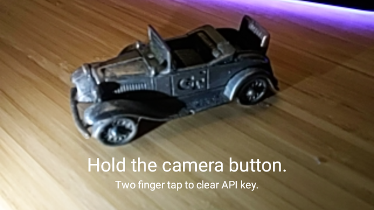
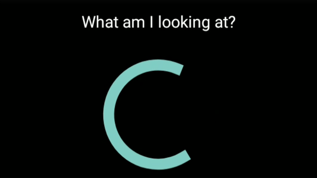
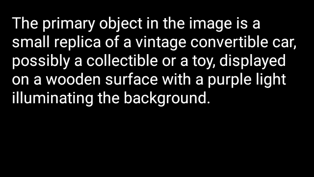

# GlassAssistant

Use OpenAI's Vision and Transcription capabilities to understand the world around you.

## Setup

1. Generate an OpenAI API Key: https://platform.openai.com/api-keys.
2. Turn the API Key into a QR Code.
3. Install and launch the GlassAssistant app on Glass.
4. Scan the generated QR Code.
5. Hold the camera button and speak for a custom prompt. Otherwise tap Glass to use a default prompt.
6. The results are vertically scrollable. Tap Glass or click the camera button to return to the Camera view.

## Screenshots

